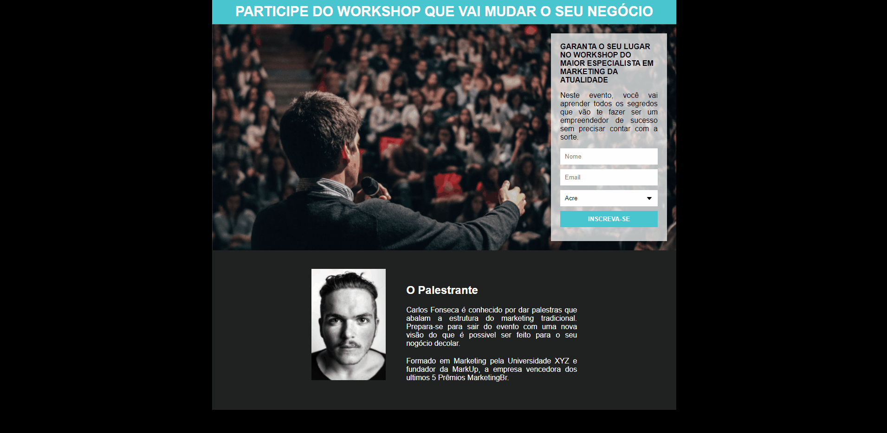
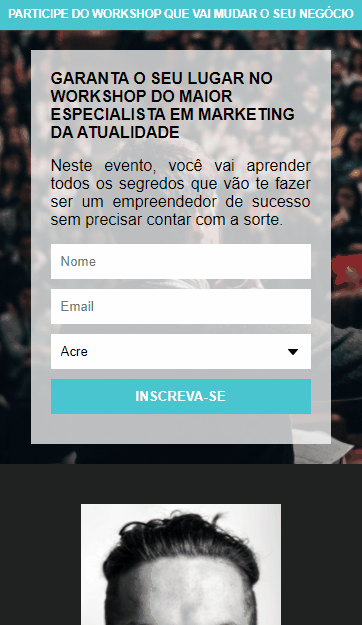

💻 Página desenvolvida para o desafio do curso Desenvolvimento Web Full Stack Programador Br, com o objetivo de aplicarmos os conhecimentos sobre inputs.

➡️ [Acesse a página clicando aqui](https://gabrielcostarep.github.io/Pagina-de-Captura/) ⬅️

 

  
  

 

## 🚀 Tecnologias

Este projeto foi desenvolvido com as seguintes tecnologias:

- ✔️ HTML
- ✔️ CSS

 

Feito por Gabriel Costa 👋🏾 [Veja meu Linkedin](https://www.linkedin.com/in/gabrielcostadev/)
